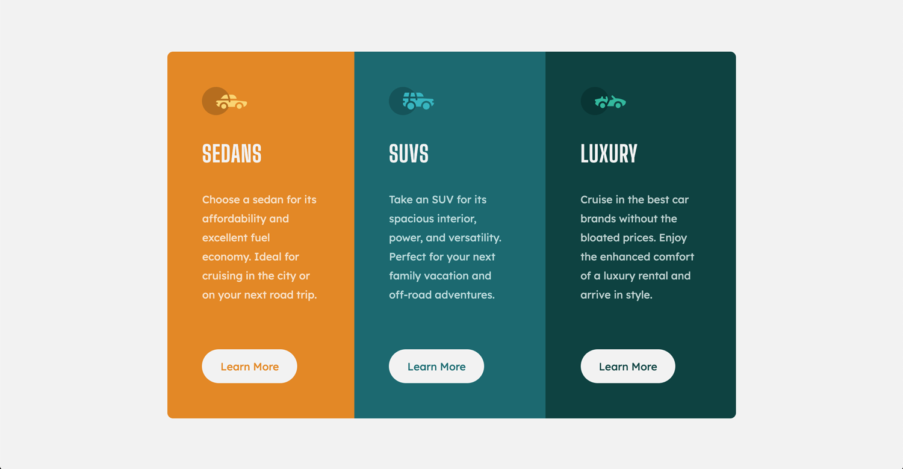

# Frontend Mentor - 3-column preview card component solution

This is a solution to the [3-column preview card component challenge on Frontend Mentor](https://www.frontendmentor.io/challenges/3column-preview-card-component-pH92eAR2-).

## Table of contents

- [Overview](#overview)
  - [The challenge](#the-challenge)
  - [Screenshot](#screenshot)
  - [Links](#links)
- [My process](#my-process)
  - [Built with](#built-with)
  - [What I learned](#what-i-learned)
- [Author](#author)

## Overview

### The challenge

Users should be able to:

- View the optimal layout depending on their device's screen size
- See hover states for interactive elements

### Screenshot

### Links

- Solution URL: [Solution](https://www.frontendmentor.io/solutions/3-column-preview-card-using-flexbox-GcjTxWPz_)
- Live Site URL: [Live Site](https://chriskorsak.github.io/3-column-preview-card-component-main/)

## My process

### Built with

- HTML5
- CSS
- Flexbox
- Mobile-first workflow
### What I learned

I got more practice with using Flexbox for page layout. I also created custom device screen dimensions in chrome developer tools to better match the jpg design files.

## Author

- Website - [Chris Korsak](https://www.chriskorsak.net)
- Frontend Mentor - [@chriskorsak](https://www.frontendmentor.io/profile/chriskorsak)
